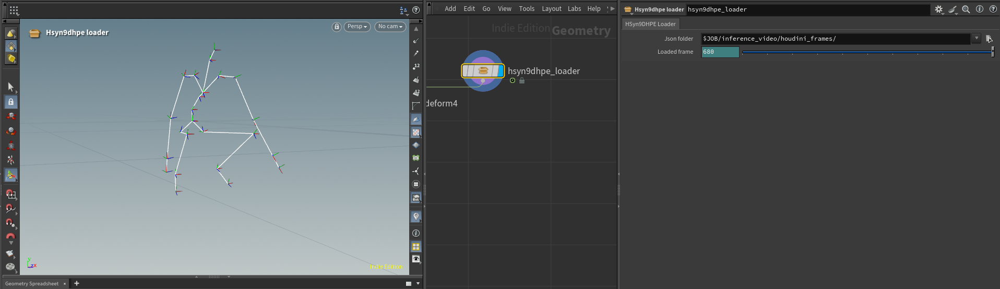
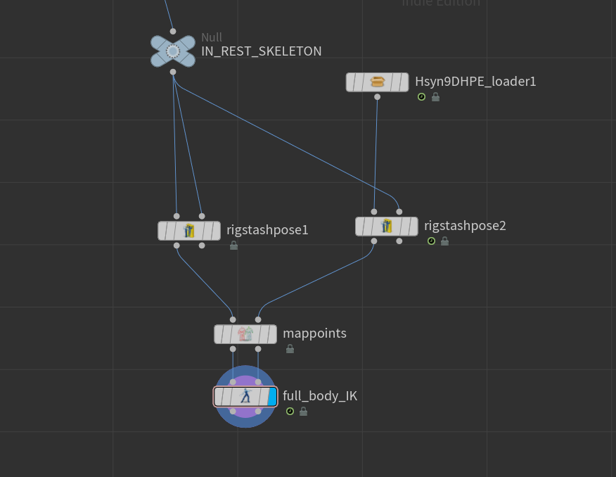

# HSyn9DHPE: 9D Human Pose Estimation with Houdini Synthetic Data

**HSyn9DHPE** = **H**oudini **Syn**thetic Data for **9D** **H**uman **P**ose **E**stimation
(9D = 3D joint positions + 6D rotation representation)

A graph-oriented transformer approach for 2D-to-3D human pose estimation achieving **57.2mm PA-MPJPE** on the 3DPW dataset using Houdini-generated synthetic data from AMASS motion capture sequences.

## Overview

This project implements a data-efficient approach to full pose estimation (3D joint positions + 6D rotation representation) by leveraging synthetic data generated through a custom Houdini pipeline. The pipeline processes AMASS motion capture sequences to create diverse training samples with perfect 3D-2D correspondence through procedural camera generation.


### Key Features

- **Full Pose Estimation**: Predicts both 3D joint positions and 6D rotation representation
- **Synthetic Data Pipeline**: Houdini-based procedural camera generation and data augmentation
- **Root-Centered Coordinate System**: Trained and predicts in pelvis-centered space for consistent pose representation
- **AMASS Motion Data**: High-quality motion capture from 7 diverse datasets
- **End-to-End Inference**: MMPose COCO-WholeBody detection → SMPL mapping → 3D pose lifting
- **Graph-Oriented Transformer**: Attention → Laplacian-polynomial graph mixing (GCN-normalized adjacency) → FFN; joint-level (24 joints); dual heads for 3D joints and 6D rotations
- **3.5M+ Training Samples**: With perfect 3D-2D correspondence

## License

- **Code:** Apache-2.0 (commercial use OK) - see [LICENSE](./LICENSE)
- **Weights:** Non-commercial research-only (if/when released)
  - See [MODEL_LICENSE.txt](./MODEL_LICENSE.txt) for full terms including prohibited uses and takedown clause
- **Data:** AMASS and SMPL not included - users must obtain separately from original sources

## Performance

Evaluated on 3DPW dataset:
- **PA-MPJPE**: 57.2mm (Procrustes-aligned mean per-joint position error)
- **MPJPE**: 120mm (mean per-joint position error)
- **MPJAE**: 36° (mean per-joint angle error)

## Architecture

I used a **graph-oriented Transformer** on the human-pose joint graph. Each layer does:

- **Self-attention** (with residuals + LayerNorm)
- **Graph mixing** along the skeleton using a **normalized adjacency** (multi-hop propagation over neighboring joints)
- A **feed-forward network** (with residuals + LayerNorm)

**Outputs:** root-centered 3D joints positions and per-joint 6D rotations (converted to 3×3 at inference).

<details>
<summary><b>Key References</b> (click to expand)</summary>

```bibtex
@inproceedings{DBLP:conf/nips/VaswaniSPUJGKP17,
  author       = {Ashish Vaswani and
                  Noam Shazeer and
                  Niki Parmar and
                  Jakob Uszkoreit and
                  Llion Jones and
                  Aidan N. Gomez and
                  Lukasz Kaiser and
                  Illia Polosukhin},
  title        = {Attention is All you Need},
  booktitle    = {{NIPS}},
  pages        = {5998--6008},
  year         = {2017}
}
@inproceedings{DBLP:conf/nips/DefferrardBV16,
  author       = {Micha{\"{e}}l Defferrard and
                  Xavier Bresson and
                  Pierre Vandergheynst},
  title        = {Convolutional Neural Networks on Graphs with Fast Localized Spectral
                  Filtering},
  booktitle    = {{NIPS}},
  pages        = {3837--3845},
  year         = {2016}
}
@inproceedings{DBLP:conf/iclr/KipfW17,
  author       = {Thomas N. Kipf and
                  Max Welling},
  title        = {Semi-Supervised Classification with Graph Convolutional Networks},
  booktitle    = {{ICLR} (Poster)},
  publisher    = {OpenReview.net},
  year         = {2017}
}
@inproceedings{DBLP:conf/cvpr/ZhaoWT22,
  author       = {Weixi Zhao and
                  Weiqiang Wang and
                  Yunjie Tian},
  title        = {GraFormer: Graph-oriented Transformer for 3D Pose Estimation},
  booktitle    = {{CVPR}},
  pages        = {20406--20415},
  publisher    = {{IEEE}},
  year         = {2022}
}
@inproceedings{DBLP:conf/iccv/MartinezHRL17,
  author       = {Julieta Martinez and
                  Rayat Hossain and
                  Javier Romero and
                  James J. Little},
  title        = {A Simple Yet Effective Baseline for 3d Human Pose Estimation},
  booktitle    = {{ICCV}},
  pages        = {2659--2668},
  publisher    = {{IEEE} Computer Society},
  year         = {2017}
}
@inproceedings{DBLP:conf/cvpr/ZhouBLYL19,
  author       = {Yi Zhou and
                  Connelly Barnes and
                  Jingwan Lu and
                  Jimei Yang and
                  Hao Li},
  title        = {On the Continuity of Rotation Representations in Neural Networks},
  booktitle    = {{CVPR}},
  pages        = {5745--5753},
  publisher    = {Computer Vision Foundation / {IEEE}},
  year         = {2019}
}
```

</details>

## Pipeline

### Data Generation

1. **AMASS Sequences**: Load motion capture data from 6 AMASS datasets (ACCAD, CMU, Transitions, DanceDB, KIT, BMLrub)
2. **Houdini Processing**:
   - Read joint rotation angles from AMASS sequences
   - Apply rotations to base SMPL skeleton (24 joints)
   - Generate procedural camera views with realistic parameters
3. **Projection & Export**: Project 3D joints to 2D using camera parameters and export .npz files containing:
   - 3D joint positions (SMPL skeleton)
   - 2D joint positions (pixel coordinates)
   - Joint rotations (3x3 rotation matrices, Houdini default)
   - Camera intrinsics and extrinsics
   - Joint visibility flags
   - Image resolution

### Camera Generation Strategy

The Houdini pipeline generates diverse synthetic cameras using procedural sampling:
- **Distance**: Primarily 1.2-3.8m with occasional extreme views (0.5-6.5m)
- **Viewing Angles**: Wide coverage with azimuth, pan, and tilt variation
- **Focal Length**: Distance-correlated (16-135mm) for realistic framing
- **Artistic Shots**: 5% extreme low/high angle perspectives


### Inference Pipeline

1. **2D Detection**: Run MMPose RTMPose on input video to extract COCO-WholeBody keypoints
2. **Keypoint Mapping**: Map COCO-WholeBody joints to SMPL skeleton (24 joints)
3. **Pose Lifting**: Feed normalized 2D keypoints to graph transformer model
4. **Prediction**: Output 3D joint positions (root-centered) and 6D rotation representation
5. **Post-Processing**: Convert 6D representation to 3x3 rotation matrices
6. **Optional Smoothing**: Apply Savitzky-Golay smoothing for positions and SLERP for rotations

**Outputs:**
- `results_frame.json`: Complete pose data with 3D positions, 6D rotations, and 3x3 rotation matrices
- `houdini_frames/`: Per-frame JSON files for Houdini import

## Installation

```bash
# Clone repository
git clone https://github.com/edoardocompagnucci/HSyn9DHPE.git
cd HSyn9DHPE

# Create conda environment
conda env create -f environment.yml
conda activate hsyn9dhpe

# Install MMPose models (required for inference)
mim download mmpose --config td-hm_hrnet-w48_8xb32-210e_coco-wholebody-384x288 --dest checkpoints/
```

### Requirements
- Python 3.10
- PyTorch 2.1.0 with CUDA 11.8
- MMPose ≥1.3.0 (COCO-WholeBody models)
- OpenCV, NumPy, Matplotlib, SciPy

## Usage

### Inference

```bash
python src/inference.py path/to/video.mp4 path/to/output/ --checkpoint checkpoints/model.pth --smooth_3d
```

**Optional smoothing flags:**
- `--smooth_detections`: Apply 2D detection smoothing to remove outliers
- `--smooth_3d`: Apply 3D pose smoothing (Savitzky-Golay + SLERP)

Additional smoothing parameters: `--max_displacement`, `--min_confidence`, `--use_kalman`, `--detection_smooth_window`, `--smooth_window` (see `python inference.py --help`)

The inference script will:
1. Extract frames from video
2. Run MMPose to detect 2D keypoints (COCO-WholeBody format)
3. Map keypoints to SMPL skeleton
4. Predict 3D positions and 6D rotations using the trained model
5. Apply optional smoothing (2D detections and/or 3D poses)
6. Save results as JSON files for further processing

### Visualizing and Using the Results

To visualize predictions in Houdini, copy `otls/Hsyn9DHPE_loader.1.0.hdalc` to `Documents\houdini<version>\otls\` and restart Houdini. The HDA loads JSON files from the `houdini_frames/` output directory.



**Post-Processing Tip:** After loading the inference frames, you can use the rest SMPL skeleton and enforce full body IK to prevent jittery rotations in more complex motions or on failed 2D detections.



## Dataset Attribution

This project uses data from the following sources:

- **[AMASS](https://amass.is.tue.mpg.de/)** - Motion capture archive (ACCAD, CMU, Transitions, DanceDB, KIT, BMLrub)
- **[SMPL](https://smpl.is.tue.mpg.de/)** - Human body model
- **[3DPW](https://virtualhumans.mpi-inf.mpg.de/3DPW/)** - Evaluation benchmark

**Complete BibTeX entries:** See [CITATIONS.md](./CITATIONS.md) and [amass.bib](./amass.bib) for all dataset citations.

## Citation

If you use this work, please cite:

```bibtex
@software{HSyn9DHPE2025,
  title = {HSyn9DHPE: 9D Human Pose Estimation with Houdini Synthetic Data},
  author = {Compagnucci, Edoardo},
  year = {2025},
  url = {https://github.com/edoardocompagnucci/HSyn9DHPE},
  note = {For non-commercial use only}
}
```

## Acknowledgments

- AMASS team for the motion capture archive
- Individual dataset contributors: ACCAD, CMU, KIT, BMLrub, Transitions, DanceDB
- SMPL team for the human body model
- 3DPW dataset creators for evaluation benchmark
- MMPose library for 2D pose detection
